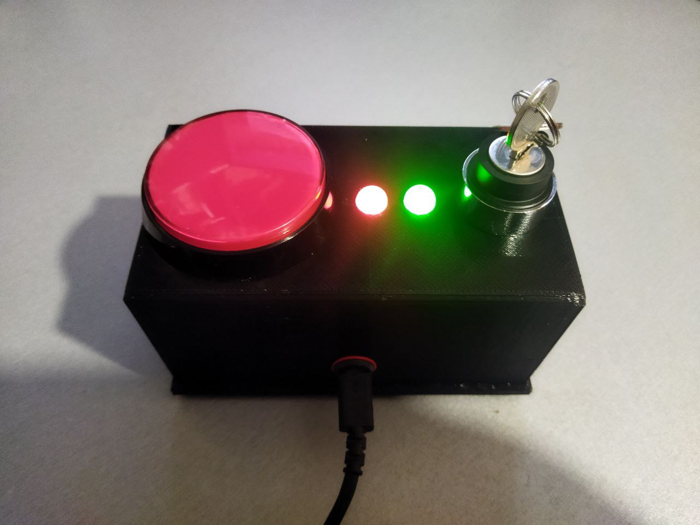

# PDU - Keyboard with key and big red button (BRB)

## Description
1. Turn on key - Keyboard press cntrl+1 imitated
2. Press BRB while key turned on - Keyboard press cntrl+2 imitated

## Files
1. FreeCAD project 
    * PDU.FCStd
2. 3mf case model
    * PDU-CaseTop.3mf
    * PDU-CaseBottom.3mf
3. Electric scheme
    * pdu.kicad_sch
    * pdu.svg
4. Firmware
    * "STM32_Source\\" - CubeIde project
    * firmware.hex - Stm32F103C8T6 builder firmware